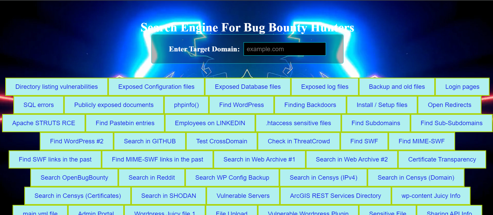

# Bug Bounty Search Engine  👾

Welcome to the **Bug Bounty Search Engine**! 🕵️‍♂️🔍 This tool is designed to help bug bounty hunters and security researchers find potential vulnerabilities and sensitive information across various targets using tailored Google searches.

## Options available ☠️

## Features 🚀

### Directory Listing Vulnerabilities

- **Description**: Search for exposed directory listings that could reveal sensitive information.
- **Usage**: Click the "Directory listing vulnerabilities" button.

### Exposed Configuration Files

- **Description**: Locate configuration files that might be publicly accessible.
- **Usage**: Click the "Exposed Configuration files" button.

### Exposed Database Files

- **Description**: Find database files that should be kept private.
- **Usage**: Click the "Exposed Database files" button.

### Exposed Log Files

- **Description**: Look for logs that might contain sensitive data.
- **Usage**: Click the "Exposed log files" button.

### Backup and Old Files

- **Description**: Search for backup files that might contain valuable information.
- **Usage**: Click the "Backup and old files" button.

### Login Pages

- **Description**: Identify login pages that could be potential targets.
- **Usage**: Click the "Login pages" button.

### SQL Errors

- **Description**: Discover pages that might reveal SQL errors.
- **Usage**: Click the "SQL errors" button.

### Publicly Exposed Documents

- **Description**: Find publicly accessible documents like PDFs and Word files.
- **Usage**: Click the "Publicly exposed documents" button.

### phpinfo()

- **Description**: Search for the phpinfo() page which could reveal sensitive information.
- **Usage**: Click the "phpinfo()" button.

### WordPress and Backdoors

- **Description**: Locate WordPress installations and potential backdoors.
- **Usage**: Use "Find WordPress" and "Finding Backdoors" buttons.

### Configuration and Setup Files

- **Description**: Find installation, setup, and configuration files.
- **Usage**: Click the "Install / Setup files" and "Sensitive Files" buttons.

### Open Redirects

- **Description**: Look for open redirects which could be exploited.
- **Usage**: Click the "Open Redirects" button.

### Apache STRUTS RCE

- **Description**: Search for Apache STRUTS Remote Code Execution vulnerabilities.
- **Usage**: Click the "Apache STRUTS RCE" button.

### Pastebin Entries

- **Description**: Locate entries on Pastebin related to your target.
- **Usage**: Click the "Find Pastebin entries" button.

### LinkedIn Employees

- **Description**: Search for employees on LinkedIn related to the target domain.
- **Usage**: Click the "Employees on LinkedIn" button.

### .htaccess and Cross-Domain Tests

- **Description**: Find sensitive .htaccess files and test for CrossDomain XML.
- **Usage**: Click the "Test CrossDomain" and ".htaccess Sensitive Files" buttons.

### Subdomains and Certificates

- **Description**: Discover subdomains, certificates, and other domain-related data.
- **Usage**: Use "Find Subdomains", "Find Sub-Subdomains", and "Certificate Transparency" buttons.

### Archive Searches

- **Description**: Explore historical snapshots of the domain in the Internet Archive.
- **Usage**: Click the "Search in Web Archive" buttons.

### Censys and SHODAN

- **Description**: Search for domain information in Censys and SHODAN.
- **Usage**: Click the "Search in Censys" and "Search in SHODAN" buttons.

### Specialized Searches

- **Description**: Perform specialized searches for various file types, configurations, and vulnerabilities.
- **Usage**: Use buttons for specific search types like "Sensitive Files", "Remote Procedure Call Protocol", etc.

## How to Use 🛠️

1. **Enter Target Domain**: Input the target domain in the provided text field.
2. **Select Search Type**: Click on the relevant button to perform a Google search with predefined queries.
3. **Review Results**: A new tab will open with the search results based on the selected query.

## Requirements 📝

- A modern web browser that supports JavaScript.
- An internet connection to perform Google searches.

## Installation 🔧

To use the Bug Bounty Search Engine, simply open the [HTML file](searchEngineForBugBounty.html) in any modern web browser. No installation is required.

## Contributing 🤝

If you'd like to contribute to the project:

1. **Fork the repository** on GitHub.
2. **Clone your fork** to your local machine.
3. **Make your changes** and commit them.
4. **Push your changes** to your fork.
5. **Submit a pull request** to the main repository.

## Author ✨

This project is maintained by [Nitin Kumar](https://www.linkedin.com/in/nitin30kumar/) 🔗

Feel free to reach out for any questions or suggestions!

## Acknowledgements 🙏

- Special thanks to the [Bug Bounty Search Engine repository](https://github.com/NitinYadav00/Bug-Bounty-Search-Engine) for inspiration and codebase contributions.
- Thanks to the open-source community and contributors for their tools and resources.
- Inspired by various bug bounty platforms and security researchers.

## Disclaimer ⚠️

**This tool is intended for educational purposes only.**

> Use it responsibly and only on domains you have explicit permission to test. Unauthorized use of this tool may be illegal and is strictly against ethical guidelines. Always adhere to ethical hacking practices and legal standards.

**Happy hunting! 🕵️‍♂️🔍**
